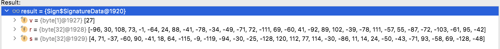

# 基于墨客联盟公链的电子签章系统

## 一、合约文档

### 链基础信息

墨客联盟链浏览器：http://39.99.191.4:4200/

墨客联盟链钱包和相关文档：http://app.moacchain.net/qWallet/qWallet/#/walletPage

墨客联盟链RPC接口：http://web3.consortium.moacchain.net/

### 合约信息

#### 合约地址

```yaml
#身份合约
identity-contract: "0x5b1C967C51CC0dCcEf6c943B85795Da192Fa27f2"
#企业签章合约
seals-router-contract: "0xFcfbbC5779155224EE3a93A3a2620Ae3B40CC89B"
#合同合约
contracts-contract: "0x4BE22C72252038Ce69Ac2FFa68E90C17b8CED054"
```

#### 合约说明

##### 身份合约

1. 架构图

   

2. 接口说明

   2.1 添加身份

   ```js
       //添加身份hash到合约 
       //_identity 为身份数据的hash值
   		// onlyOwner仅平台管理员可操作
       function addIdentity(bytes memory _identity) public onlyOwner returns (bool) {
           require(!isValid[_identity], "identity has exist");//判断是否已添加过了
           isValid[_identity] = true;//身份存入
           emit AddIdentityEvent(_identity);//产生事件
           return true;
       }
   ```

   2.2 吊销身份

   ```js
       //吊销身份hash到合约 
       //_identity 为身份数据的hash值
       // onlyOwner仅平台管理员可操作
       function revokeIdentity(bytes memory _identity) public onlyOwner returns (bool) {
           require(isValid[_identity], "identity has revoked");//判断是否已吊销过了
           isValid[_identity] = false;//身份吊销
           lastEfficacyTime[_identity] = block.timestamp;//存入吊销时间
           emit LoseEfficacyEvent(_identity);//产生吊销事件
           return true;
       }
   ```

   2.3 查询身份

   ```js
       //根据身份hash 和时间查询此身份是否有效
       //_identity 为身份数据的hash值
       //_time 时间
       function queryIdentity(bytes memory _identity, uint256 _time) public view returns (bool) {
           if (isValid[_identity]) {//如果当前身份有效，直接返回true
               return true;
           } else {
               if (lastEfficacyTime[_identity] > _time) {//如果当前身份失效，查询在需要验证的时间前，身份是否有效
                   return true;
               }
           }
           return false;
       }
   
       //根据身份hash 查询此身份吊销时间
       //_identity 为身份数据的hash值
       function queryEfficacyTime(bytes memory _identity) public view returns (uint256) {
           return lastEfficacyTime[_identity];//返还吊销时间，如果返回0，说明没有吊销
       }
   
   ```
   
   

##### 签章工厂合约

1. 架构图

   

2. 接口说明

​		2.1创建企业签章合约

```js
    //创建企业签章合约 仅管理员可以调用
    //_legalAddr 法人的did对应的address
    //_creditCode 企业的唯一识别码
    function createSeal(address _legalAddr, bytes calldata _creditCode) external onlyOwner returns (address sealAddr) {
        require(_legalAddr != address(0), "SealsFactory: ZERO_ADDRESS");
        require(getSeal[_legalAddr][_creditCode] == address(0), "SealsFactory: Seal_EXISTS"); // 判断此合约是否已创建
        bytes memory bytecode = type(Seals).creationCode;
        bytes32 salt = keccak256(abi.encodePacked(_legalAddr, _creditCode));
        assembly {
            sealAddr := create2(0, add(bytecode, 32), mload(bytecode), salt)//create2底层调用 创建企业签章合约
        }
        Seals(sealAddr).initialize(_legalAddr); //初始化企业签章合约的管理员为企业法人
        getSeal[_legalAddr][_creditCode] = sealAddr; //记录签章合约地址对应关系
        allSeals.push(sealAddr);//记录签章合约地址
        emit SealsCreated(_legalAddr, _creditCode, sealAddr, allSeals.length);//产生企业签章合约事件
    }
```


​	2.2 携带签名的签章授权

​		2.2.1 路由工厂合约

```js
    //带签名的企业签章合约授权 任何人都可以调用 但需要携带管理员签名
    function approvalDelegate(
        address sealAddr, //签章合约地址
        uint8 _sealType,//企业签章合约id 1合同章2财务章3合同章 100以后为企业自定义章
        address _addr,//授权对象
        uint256 _signTime,//签名时间
        uint8 v,//ecdsa签名值 v r s
        bytes32 r,
        bytes32 s
    ) public returns (bool) {
        emit ApprovalDelegate(sealAddr, _sealType, _addr);
        return Seals(sealAddr).approvalDelegate(_sealType, _addr, _signTime, v, r, s);//工厂路由合约调用具体企业合约的授权方法
    }
	
```

​		2.2.2 企业签章合约

```js
    
//带签名的企业签章合约授权 任何人都可以调用 但需要携带管理员签名
    function approvalDelegate(
        uint8 _sealType,
        address _addr,
        uint256 _signTime,
        uint8 v,
        bytes32 r,
        bytes32 s
    ) public returns (bool) {
        require(!approvalMap[_sealType][_addr], "_addr has exist"); //判断是否已授权
        require(lastChangeTime[_sealType][_addr] < _signTime, "_sign is invalid");//防止签名数据被重放
        address recoverAddr = recover(v, r, s, abi.encodePacked(address(this), _sealType, _addr, _signTime));//验证签名
        require(recoverAddr == owner(), "_sign is error");//验证签名人是否是管理员
        approvalMap[_sealType][_addr] = true;//签章授权
        lastChangeTime[_sealType][_addr] = _signTime;//记录最后一次授权时间
        emit ApprovalEvent(_addr, true);//产生事件
        return true;
    }
```

2.3 携带签名的签章吊销

​		2.3.1 路由工厂合约

```js
    //带签名的企业签章合约吊销 任何人都可以调用 但需要携带管理员签名
    function revokeDelegate(
        address sealAddr, //签章合约地址
        uint8 _sealType,//企业签章合约id 1合同章2财务章3合同章 100以后为企业自定义章
        address _addr,//授权对象
        uint256 _signTime,//签名时间
        uint8 v,//ecdsa签名值 v r s
        bytes32 r,
        bytes32 s
    ) public returns (bool) {
        emit RevokeDelegate(sealAddr, _sealType, _addr);
        return Seals(sealAddr).revokeDelegate(_sealType, _addr, _signTime, v, r, s);
    }
```

​		2.3.2 企业签章合约

```js
    //带签名的企业签章合约吊销 任何人都可以调用 但需要携带管理员签名
    function revokeDelegate(
        uint8 _sealType,
        address _addr,
        uint256 _signTime,
        uint8 v,
        bytes32 r,
        bytes32 s
    ) public returns (bool) {
        require(approvalMap[_sealType][_addr], "_addr has revoked");//判断是否已吊销
        require(lastChangeTime[_sealType][_addr] < _signTime, "_sign is invalid");//防止签名数据被重放
        address recoverAddr = recover(v, r, s, abi.encodePacked(address(this), _sealType, _addr, _signTime));//验证签名
        require(recoverAddr == owner(), "_sign is error");//验证签名人是否是管理员
        approvalMap[_sealType][_addr] = false;//签章吊销
        lastChangeTime[_sealType][_addr] = _signTime;//记录最后一次吊销时间
        emit RevokeEvent(_addr, false);//产生事件
        return true;
    }

```

​	2.4 授权吊销参数构建

```js
    //授权吊销参数构建（前端可参考）
    function encodePacked(
        address sealAddr,//签章合约地址
        uint8 _sealType,//签章类型
        address _addr,//授权地址
        uint256 _signTime//授权时间
    ) public pure returns (bytes memory res) {
        res = abi.encodePacked(sealAddr, _sealType, _addr, _signTime);
    }
```

​	2.5 查询签章授权情况

   ```js
       //查询签章授权情况
       function querySealApprovl(
           address sealAddr,//签章合约地址
           uint8 _sealType,//签章类型
           address _addr//查询地址
       ) public view returns (bool) {
           return Seals(sealAddr).query(_sealType, _addr);
       }
   ```

   

##### 合同合约

1. 合约架构


2. 接口说明

   2.1 合同签章数据上链 

```js
    //合同签章数据上链 任何人均可调用
    function addSign(
        bytes memory _contractHash, //合同原文hash
        bytes memory _signHash, //待签名数据hash
        address _sealaddr, //签章合约地址 如果个人签名，此值传0
        uint8 _sealType, //签章类型  ，如果个人签名，此值传0
        address _signAddr, //签名地址
        uint8 v, //签名值 v r s
        bytes32 r,
        bytes32 s
    ) public returns (bool) {
        require(!isExist(_contractHash, _signHash, _sealaddr, _sealType, _signAddr), "_sign is exist");//判断此签名是否已经上链
        bool res1 = SealsRouter(_sealaddr).querySealStatus(_sealaddr);//查询签章合约是否存在
        require(res1, "seal is revoked");
        bool res2 = Seals(_sealaddr).query(_sealType, _signAddr);//查询签名地址是否获得授权
        require(res2, "_signAddr has not permission");
        address recoverAddr = recover(v, r, s, _signHash);//校验签名是否正确
        require(recoverAddr == _signAddr, "_sign is error");
        Signature[] storage signArry = contractMap[_contractHash];//按照合同原文hash分类储存
        signArry.push(Signature(_signHash, _sealaddr, _sealType, _signAddr, block.timestamp));//记录此前到签名数组中去
        signatureMap[_contractHash][abi.encodePacked(_signHash, _sealaddr, _sealType, _signAddr)] = signArry.length;//记录此签名的排序
        return true;
    }
```

2.2 查询签名是否有效

```js
    //查询签名是否有效存在
    function isExist(
        bytes memory _contractHash,//合同原文hash
        bytes memory _signHash, //待签名数据hash
        address _sealaddr, //签章合约地址 如果签章，此值传0
        uint8 _sealType, //签章类型
        address _signAddr //签名地址
    ) public view returns (bool) {
        if (signatureMap[_contractHash][abi.encodePacked(_signHash, _sealaddr, _sealType, _signAddr)] > 0) {
            return true;
        }else{
            return false;
        }
    }
```

2.3 查询签名的上链时间

```js
    //查询签名的上链时间
    function querySignTimel(
        bytes memory _contractHash,//合同原文hash
        bytes memory _signHash, //待签名数据hash
        address _sealaddr, //签章合约地址
        uint8 _sealType, //签章类型
        address _signAddr //签名地址
    ) public view returns (uint256 _signTime) {
        require(isExist(_contractHash, _signHash, _sealaddr, _sealType, _signAddr), "_sign is not exist");
        uint256 index = query(_contractHash, _signHash, _sealaddr, _sealType, _signAddr);
        Signature memory sign = contractMap[_contractHash][index];
        return sign._signTime;
    }
```


### 参数构造说明

#### 签章授权/吊销签名数据

```js
//带签名的企业签章合约授权 任何人都可以调用 但需要携带管理员签名
function approvalDelegate(
  address sealAddr, //签章合约地址
  uint8 _sealType,//企业签章合约id 1合同章2财务章3合同章 100以后为企业自定义章
  address _addr,//授权对象
  uint256 _signTime,//签名时间（时间戳）
  uint8 v,//ecdsa签名值 v r s
  bytes32 r,
  bytes32 s
)
加密参数举例：        
   sealAddr=0xd7Ca4e99F7C171B9ea2De80d3363c47009afaC5F
  _sealType=1
  _addr=0xe917c3cba62dea294655ee70c2633d68cf9fb67f
  _signTime=1637548172465
      
```

1. 对参数进行web3.utils.encodePacked编码
           res=abi.encodePacked(sealAddr,_sealType,_addr,_signTime)
    结果为字节数组，进行16进制编码： res=0xd7ca4e99f7c171b9ea2de80d3363c47009afac5f01e917c3cba62dea294655ee70c2633d68cf9fb67f0000000000000000000000000000000000000000000000000000017d457a24b1

2. 对编码后的数据进行web3.eth.sign(web3.utils.sha3(res),ECDSA签名，

   使用的签名地址为：0x784fd8a46196cc03d50a7f8b40d8eefd496ad083，

   对应的私钥（10进制）为：9039690924641653913532830016060616677010009893255883084965509394499970186716

​       签名后的数据为   :



​	对其合并序列化，再进行base64编码：

```json
res = G6AebEn/wBhY17Lez7lIkUXEKaRZZtmyb8c3qbiZw1/WBEfbxFrXEkCN94mi4ueAeHBNcuKqCw4YztW5XcZFgNA=
```

​	


#### 合同签名数据

1. 构建签名对象

```json
//合同签名原始数据
{
	"signerVC": {
		"issuer": "did:gid:e917c3cba62dea294655ee70c2633d68cf9fb67f",
		"issuanceDate": 1637572471072,
		"context": "https://gaoshan.co/gsidentity/credentials/v1",
		"claim": {
			"code": "2323sdf24w23f23f23f23f",
			"legalDid": "did:gid:e917c3cba62dea294655ee70c2633d68cf9fb67f",
			"type": "individual",
			"legalName": "企业法人",
			"name": "高山科技有限公司",
			"did": "did:gid:557e72416d7763395c7daae0377902ce3b5c41a6" 
		},
		"id": "ee167f65-6bea-4738-8bfe-55f6d7348aa4",
		"proof": {
			"creator": "did:gid:e917c3cba62dea294655ee70c2633d68cf9fb67f",
			"signature": "G5K8F2sCMk8uCt5mLq3fMAwyoQ8Nq0zqTWjjOHCSmd+kU7pyXIdy0D8DPGa+EcgmTqp5B7af6d01W6bioxUL9oQ=",
			"created": "1637572471072",
			"type": "Secp256k1"
		},
		"expirationDate": 1952932471072
	},
	"contractHash": "464421b8ba40f261abbd8a81010607f6e4b2e0dd07bde5e108bea641e146ab00",
	"type": 1,
	"signDate": 1637572471105,
	"nestSignature": {},
	"sealsClaim": {
		"0": [{
			"sign": {
				"picUrl": "https://yinji.gaoshan.co/oss/gs2021/20211101/1-1455132664389701632.png"
			},
			"target": {
				"phone": "13476615091",
				"name": "安徽高山科技有限公司"
			},
			"x": 204.575,
			"signType": 0,
			"y": 198.73,
			"position": 0,
			"signIndex": 0
		}]
	},
	"context": "https://gaoshan.co/gsidentity/credentials/v1",
	"id": "a6104690-3c71-4e76-9bc7-1a21e0a4874d"
}
```

将"proof": null,对json数据，按key字符顺序，进行从外到内递归排序，并序列化：

```json
//序列化后的数据
{"context":"https://gaoshan.co/gsidentity/credentials/v1","contractHash":"464421b8ba40f261abbd8a81010607f6e4b2e0dd07bde5e108bea641e146ab00","id":"a6104690-3c71-4e76-9bc7-1a21e0a4874d","nestSignature":{"context":null,"contractHash":null,"id":null,"nestSignature":null,"proof":null,"sealsClaim":null,"signDate":null,"signerVC":null,"type":null},"proof":null,"sealsClaim":{"0":[{"position":0,"sign":{"picUrl":"https://yinji.gaoshan.co/oss/gs2021/20211101/1-1455132664389701632.png"},"signIndex":0,"signType":0,"target":{"name":"安徽高山科技有限公司","phone":"13476615091"},"x":204.575,"y":198.73}]},"signDate":1637572471105,"signerVC":{"claim":{"code":"2323sdf24w23f23f23f23f","did":"did:gid:557e72416d7763395c7daae0377902ce3b5c41a6","legalDid":"did:gid:e917c3cba62dea294655ee70c2633d68cf9fb67f","legalName":"企业法人","name":"高山科技有限公司","type":"individual"},"context":"https://gaoshan.co/gsidentity/credentials/v1","expirationDate":1952932471072,"id":"ee167f65-6bea-4738-8bfe-55f6d7348aa4","issuanceDate":1637572471072,"issuer":"did:gid:e917c3cba62dea294655ee70c2633d68cf9fb67f","proof":{"created":"1637572471072","creator":"did:gid:e917c3cba62dea294655ee70c2633d68cf9fb67f","signature":"G5K8F2sCMk8uCt5mLq3fMAwyoQ8Nq0zqTWjjOHCSmd+kU7pyXIdy0D8DPGa+EcgmTqp5B7af6d01W6bioxUL9oQ=","type":"Secp256k1"}},"type":1}
```

再对序列后的数据，sha3（序列化后的数据）==（bytes memory _signHash, //待签名数据hash）==

得到数据摘要： 0x7e2726feecded3af0cf3304aee1e005a8d100546fab8d612c84f602f17096ed7。

2. 对数据进行web3.eth.sign( web3.utils.sha3(web3.utils.hexToBytes(res)),ECDSA签名，

   使用的签名地址为：0x784fd8a46196cc03d50a7f8b40d8eefd496ad083，

   对应的私钥（10进制）为：9039690924641653913532830016060616677010009893255883084965509394499970186716

   得到的签名值为：

   

   字节转16进制数据如下（此步不需要处理，仅作为js操作时候的参考）

   ```json
   v 27
   v 0x1b
   r 0x7226cbd98b4b4d327078ef2a49466d331f72966229d55b1375d71352c379203f
   s 0x229bab6b563f65ebb6a244584e303964ac8504cbdd3d980bd9fa6d8b38d11b9d
   ```

   进行压缩后base64编码得到(编码的规格是，是new byte[65]数组依次将v,r,s拼接起来，然后base64Encode)

   ```json
   G3Imy9mLS00ycHjvKklGbTMfcpZiKdVbE3XXE1LDeSA/Ipura1Y/Zeu2okRYTjA5ZKyFBMvdPZgL2fptizjRG50=
   ```

   将签名值和签名信息写入原json信息中

   得到

   ```json
   {
   	"signerVC": {
   		"issuer": "did:gid:e917c3cba62dea294655ee70c2633d68cf9fb67f",
   		"issuanceDate": 1637572471072,
   		"context": "https://gaoshan.co/gsidentity/credentials/v1",
   		"claim": {
   			"code": "2323sdf24w23f23f23f23f",
   			"legalDid": "did:gid:e917c3cba62dea294655ee70c2633d68cf9fb67f",
   			"type": "individual",
   			"legalName": "企业法人",
   			"name": "高山科技有限公司",
   			"did": "did:gid:557e72416d7763395c7daae0377902ce3b5c41a6"  //address _sealaddr,//签章合约地址
   		},
   		"id": "ee167f65-6bea-4738-8bfe-55f6d7348aa4",
   		"proof": {
   			"creator": "did:gid:e917c3cba62dea294655ee70c2633d68cf9fb67f",
   			"signature": "G5K8F2sCMk8uCt5mLq3fMAwyoQ8Nq0zqTWjjOHCSmd+kU7pyXIdy0D8DPGa+EcgmTqp5B7af6d01W6bioxUL9oQ=",
   			"created": "1637572471072",
   			"type": "Secp256k1"
   		},
   		"expirationDate": 1952932471072
   	},
   	"contractHash": "464421b8ba40f261abbd8a81010607f6e4b2e0dd07bde5e108bea641e146ab00",
   	"type": 1,																											//uint8 _sealType, //签章类型
   	"signDate": 1637572471105,
   	"nestSignature": {},
   	"sealsClaim": {
   		"0": [{
   			"sign": {
   				"picUrl": "https://yinji.gaoshan.co/oss/gs2021/20211101/1-1455132664389701632.png"
   			},
   			"target": {
   				"phone": "13476615091",
   				"name": "安徽高山科技有限公司"
   			},
   			"x": 204.575,
   			"signType": 0,
   			"y": 198.73,
   			"position": 0,
   			"signIndex": 0
   		}]
   	},
   	"context": "https://gaoshan.co/gsidentity/credentials/v1",
   	"id": "a6104690-3c71-4e76-9bc7-1a21e0a4874d",
   	"proof": {
   		"creator": "did:gid:784fd8a46196cc03d50a7f8b40d8eefd496ad083",   // address _signAddr, //签名地址
   		"signature": "G3Imy9mLS00ycHjvKklGbTMfcpZiKdVbE3XXE1LDeSA/Ipura1Y/Zeu2okRYTjA5ZKyFBMvdPZgL2fptizjRG50=",
   		"created": "1637572471105",
   		"type": "Secp256k1"
   	}
   }
   ```

   将完整的签名信息提交至服务器.

3. 对上述签名值再次签名的，结果如下==(此步骤非必需)==

   ```json
   {
   	"signerVC": {
   		"issuer": "did:gid:e917c3cba62dea294655ee70c2633d68cf9fb67f",
   		"issuanceDate": 1637572914681,
   		"context": "https://gaoshan.co/gsidentity/credentials/v1",
   		"claim": {
   			"code": "2323sdf24w23f23f23f23f",
   			"legalDid": "did:gid:e917c3cba62dea294655ee70c2633d68cf9fb67f",
   			"type": "individual",
   			"legalName": "企业法人",
   			"name": "高山科技有限公司",
   			"did": "did:gid:557e72416d7763395c7daae0377902ce3b5c41a6"
   		},
   		"id": "4af3936b-7a77-46c0-bf1d-a9ef61e78313",
   		"proof": {
   			"creator": "did:gid:e917c3cba62dea294655ee70c2633d68cf9fb67f",
   			"signature": "HPHf0BXrHf9BN6qZPCO4ykIi6YJWKl1jnNPzMINN/+2IXvkbEB6Tfykz1yR6KGf9Y2wBZNAhECWwz0pCU1TMJ28=",
   			"created": "1637572914681",
   			"type": "Secp256k1"
   		},
   		"expirationDate": 1952932914681
   	},
   	"contractHash": "464421b8ba40f261abbd8a81010607f6e4b2e0dd07bde5e108bea641e146ab00",
   	"type": 1,
   	"signDate": 1637572914687,
   	"nestSignature": {
   		"signerVC": {
   			"issuer": "did:gid:e917c3cba62dea294655ee70c2633d68cf9fb67f",
   			"issuanceDate": 1637572471072,
   			"context": "https://gaoshan.co/gsidentity/credentials/v1",
   			"claim": {
   				"code": "2323sdf24w23f23f23f23f",
   				"legalDid": "did:gid:e917c3cba62dea294655ee70c2633d68cf9fb67f",
   				"type": "individual",
   				"legalName": "企业法人",
   				"name": "高山科技有限公司",
   				"did": "did:gid:557e72416d7763395c7daae0377902ce3b5c41a6"
   			},
   			"id": "ee167f65-6bea-4738-8bfe-55f6d7348aa4",
   			"proof": {
   				"creator": "did:gid:e917c3cba62dea294655ee70c2633d68cf9fb67f",
   				"signature": "G5K8F2sCMk8uCt5mLq3fMAwyoQ8Nq0zqTWjjOHCSmd+kU7pyXIdy0D8DPGa+EcgmTqp5B7af6d01W6bioxUL9oQ=",
   				"created": "1637572471072",
   				"type": "Secp256k1"
   			},
   			"expirationDate": 1952932471072
   		},
   		"contractHash": "464421b8ba40f261abbd8a81010607f6e4b2e0dd07bde5e108bea641e146ab00",
   		"type": 1,
   		"signDate": 1637572471105,
   		"nestSignature": {},
   		"sealsClaim": {
   			"0": [{
   				"sign": {
   					"picUrl": "https://yinji.gaoshan.co/oss/gs2021/20211101/1-1455132664389701632.png"
   				},
   				"target": {
   					"phone": "13476615091",
   					"name": "安徽高山科技有限公司"
   				},
   				"x": 204.575,
   				"signType": 0,
   				"y": 198.73,
   				"position": 0,
   				"signIndex": 0
   			}]
   		},
   		"context": "https://gaoshan.co/gsidentity/credentials/v1",
   		"id": "a6104690-3c71-4e76-9bc7-1a21e0a4874d",
   		"proof": {
   			"creator": "did:gid:784fd8a46196cc03d50a7f8b40d8eefd496ad083",
   			"signature": "HDYzeKexj3L3sB+t1U8yN6gsDZYRXHZkQcFmqFfCSWh0HTagfONNOoSteFHWQ7GumWs1vV1OkubOvwkeQ/hS824=",
   			"created": "1637572471105",
   			"type": "Secp256k1"
   		}
   	},
   	"sealsClaim": {
   		"0": [{
   			"sign": {
   				"picUrl": "https://yinji.gaoshan.co/oss/gs2021/20211101/1-1455132664389701632.png"
   			},
   			"target": {
   				"phone": "13476615091",
   				"name": "安徽高山科技有限公司"
   			},
   			"x": 204.575,
   			"signType": 0,
   			"y": 198.73,
   			"position": 0,
   			"signIndex": 0
   		}]
   	},
   	"context": "https://gaoshan.co/gsidentity/credentials/v1",
   	"id": "52e8e860-693e-48ce-baa4-cebaa822fa3c",
   	"proof": {
   		"creator": "did:gid:784fd8a46196cc03d50a7f8b40d8eefd496ad083",
   		"signature": "HI+98qflS1XDBkboAf6PpJcgea71lsMl9daVvrp+N8L9aPLhIYlZPV38einBevY2drKoXtsfqrsmc4+GLNTI6OE=",
   		"created": "1637572914687",
   		"type": "Secp256k1"
   	}
   }
   ```

   

### vc身份hash值计算(上链用)

1. 原始数据

   ```json
   {
   	"issuer": "did:gid:e917c3cba62dea294655ee70c2633d68cf9fb67f",
   	"issuanceDate": 1637336181742,
   	"context": "https://gaoshan.co/gsidentity/credentials/v1",
   	"claim": {
   		"type": "IDCard",
   		"name": "黄丰",
   		"did": "did:gid:55229ae75968b49d502b0adf103aba58f7ed680a"
   	},
   	"id": "ef463408-e8fe-4c7f-af70-ed7dafe2647f",
   	"proof": {
   		"creator": "did:gid:e917c3cba62dea294655ee70c2633d68cf9fb67f",
   		"signature": "GwyYjQNgUytrgdtLlIhY7+HCbJ/D59qcabB8boeXNTlTDy7ex8HlGu0vbYM04CwAIH0AywMqne4tQtC4hRzqeGQ=",
   		"created": "1637336181742",
   		"type": "Secp256k1"
   	},
   	"expirationDate": 1639163569134
   }
   ```

2. 对claim字段逐个进行sha3计算，并按key字符顺序拼接

   ```json
   {
   	"issuer": "did:gid:e917c3cba62dea294655ee70c2633d68cf9fb67f",
   	"issuanceDate": 1637336181742,
   	"context": "https://gaoshan.co/gsidentity/credentials/v1",
   	"claim": "did0xd2171990f332e3edff54906bc337743bd71d6c2e190c15b8110906a43577b05aname0xb868dab9e09ea9847f43521abf2003865f46f160ec42143fdff164a8f8089924type0x37909b84852880d0045b83a030e020b1920d249e618a3df84b092f68745cfa20",
   	"id": "ef463408-e8fe-4c7f-af70-ed7dafe2647f",
   	"proof": {
   		"creator": "did:gid:e917c3cba62dea294655ee70c2633d68cf9fb67f",
   		"signature": "GwyYjQNgUytrgdtLlIhY7+HCbJ/D59qcabB8boeXNTlTDy7ex8HlGu0vbYM04CwAIH0AywMqne4tQtC4hRzqeGQ=",
   		"created": "1637336181742",
   		"type": "Secp256k1"
   	},
   	"expirationDate": 1639163569134
   }
   ```

   

3. 再对所有数据进行排序，序列化

   ```json
   {"claim":"did0xd2171990f332e3edff54906bc337743bd71d6c2e190c15b8110906a43577b05aname0xb868dab9e09ea9847f43521abf2003865f46f160ec42143fdff164a8f8089924type0x37909b84852880d0045b83a030e020b1920d249e618a3df84b092f68745cfa20","context":"https://gaoshan.co/gsidentity/credentials/v1","expirationDate":1639163569134,"id":"ef463408-e8fe-4c7f-af70-ed7dafe2647f","issuanceDate":1637336181742,"issuer":"did:gid:e917c3cba62dea294655ee70c2633d68cf9fb67f","proof":{"created":"1637336181742","creator":"did:gid:e917c3cba62dea294655ee70c2633d68cf9fb67f","signature":"GwyYjQNgUytrgdtLlIhY7+HCbJ/D59qcabB8boeXNTlTDy7ex8HlGu0vbYM04CwAIH0AywMqne4tQtC4hRzqeGQ=","type":"Secp256k1"}}
   ```

4. 对序列后的数据进行进行，sha3计算摘要

   ```json 
   0x531f684236b86a1a6b1c4568501928c5e2ce13acbfd5f9a89e52be3275d803c2
   ```

   

### vc身份hash值计算(签名用)

1. 原始数据同上，但需要将proof字段清空，如下

   ```json
   {
   	"issuer": "did:gid:e917c3cba62dea294655ee70c2633d68cf9fb67f",
   	"issuanceDate": 1637336181742,
   	"context": "https://gaoshan.co/gsidentity/credentials/v1",
   	"claim": {
   		"type": "IDCard",
   		"name": "黄丰",
   		"did": "did:gid:55229ae75968b49d502b0adf103aba58f7ed680a"
   	},
   	"id": "ef463408-e8fe-4c7f-af70-ed7dafe2647f",
   	"expirationDate": 1639163569134,
     "proof":null
   }
   ```
   
   

2.后续计算hash值的方式同上（对claim字段逐个进行sha3计算，并按key字符顺序拼接，再对所有数据进行排序，序列化，对序列后的数据进行进行，sha3计算摘要）,结果如下：

```json
0xb0e215d91cfe04834b3775f79ec2006ee12309bcedbc5ab9531351a4dd689d32
```


### 合同验证流程

1. 计算合同pdf的hash值，与签名数据contractHash进行比对，签名数据如下：

   ```json
   {
   	"signerVC": {
   		"issuer": "did:gid:e917c3cba62dea294655ee70c2633d68cf9fb67f",
   		"issuanceDate": 1637572471072,
   		"context": "https://gaoshan.co/gsidentity/credentials/v1",
   		"claim": {
   			"code": "2323sdf24w23f23f23f23f",
   			"legalDid": "did:gid:e917c3cba62dea294655ee70c2633d68cf9fb67f",
   			"type": "individual",
   			"legalName": "企业法人",
   			"name": "高山科技有限公司",
   			"did": "did:gid:557e72416d7763395c7daae0377902ce3b5c41a6"  //address _sealaddr,//签章合约地址
   		},
   		"id": "ee167f65-6bea-4738-8bfe-55f6d7348aa4",
   		"proof": {
   			"creator": "did:gid:e917c3cba62dea294655ee70c2633d68cf9fb67f",
   			"signature": "G5K8F2sCMk8uCt5mLq3fMAwyoQ8Nq0zqTWjjOHCSmd+kU7pyXIdy0D8DPGa+EcgmTqp5B7af6d01W6bioxUL9oQ=",
   			"created": "1637572471072",
   			"type": "Secp256k1"
   		},
   		"expirationDate": 1952932471072
   	},
   	"contractHash": "464421b8ba40f261abbd8a81010607f6e4b2e0dd07bde5e108bea641e146ab00",
   	"type": 1,																											//uint8 _sealType, //签章类型
   	"signDate": 1637572471105,
   	"nestSignature": {},
   	"sealsClaim": {
   		"0": [{
   			"sign": {
   				"picUrl": "https://yinji.gaoshan.co/oss/gs2021/20211101/1-1455132664389701632.png"
   			},
   			"target": {
   				"phone": "13476615091",
   				"name": "安徽高山科技有限公司"
   			},
   			"x": 204.575,
   			"signType": 0,
   			"y": 198.73,
   			"position": 0,
   			"signIndex": 0
   		}]
   	},
   	"context": "https://gaoshan.co/gsidentity/credentials/v1",
   	"id": "a6104690-3c71-4e76-9bc7-1a21e0a4874d",
   	"proof": {
   		"creator": "did:gid:784fd8a46196cc03d50a7f8b40d8eefd496ad083",   // address _signAddr, //签名地址
   		"signature": "G3Imy9mLS00ycHjvKklGbTMfcpZiKdVbE3XXE1LDeSA/Ipura1Y/Zeu2okRYTjA5ZKyFBMvdPZgL2fptizjRG50=",
   		"created": "1637572471105",
   		"type": "Secp256k1"
   	}
   }
   ```

   

2. 验证签名者身份，signerVC字段。

   2.1 先验证vc身份本身的签名是否正确，messagehash参考==vc身份hash值计算(签名用)==，验证其签名值signerVC->proof->signature是否正确

   2.2 再验证vc身份在身份合约identity中，在签署此份合同时（signDate），是否已经吊销，调用身份合约的==查询接口==

3. 验证合同签名，messagehash参考（==见合同签名数据==），验证proof->signature是否正确且是creator签署

4. 链上验证：调用合同合约的（==查询签名是否有效==）接口。


## 二、后端JAVA文档

### 项目主要结构说明

```text
│── gs-chain		// 合约调用模块																			

│  │── pom.xml

│  └── src

│    │── main

│    │  │── java

│    │  │  └── com

│    │  │    └── gaoshan

│    │  │      └── chain

│    │  │        │── GsChainApplication.java				//启动类

│    │  │        │── config												//配置项

│    │  │        │── constant											//一些常量

│    │  │        │── constract

│    │  │        │  │── ContractsContract.java			//合约合约的java实现

│    │  │        │  │── IdentityContract.java				//身份合约的java实现

│    │  │        │  │── SealsRouterContract.java		//公司签章合约的java实现

│    │  │        │  └── engine

│    │  │        │    │── BaseEngine.java						//引擎基类

│    │  │        │    │── ContractsContractEngine.java	/合约合约引擎

│    │  │        │    │── IdentityContractEngine.java		//身份合约合约引擎

│    │  │        │    └── SealsRouterContractEngine.java		//公司签章合约引擎

│    │  │        │── entity											//一些实体类

│    │  │        │── service

│    │  │        │  │── ContractServiceImpl.java	//合同合约的Service层，封装了签名添加、查询相关方法

│    │  │        │  │── SealsServiceImpl.java		//签章合约的Service层，封装了签章生成、授权、查询相关方法

│    │  │        │  └── VcServiceImpl.java 			//身份合约的Service层，封装了vc相关方法

│    │  │        │── util

│    │  │        │  │── CredentialPojoUtils.java	//vc相关类

│    │  │        │  │── CredentialUtils.java		  //vc相关类

│    │  │        │  │── DataToolUtils.java			//数据构造转化相关类

│    │  │        │  │── DateUtils.java					//日期生成转化相关类

│    │  │        │  └── GIdUtils.java						//did生成转化相关类

│    │  │        └── validator									//校验相关类

│    │  └── resources

│    │    └── application.yml									//项目配置

│    └── test.java.com.gaoshan.chain. service.

│                							└── ChainTest.java	//测试类，所有方法的调用示例均在此可以找到

│── gs-common 														// 基础模块

└── pom.xml															 // maven配置
```


### 代码使用说明

#### 配置基本变量

```yaml
修改application.yml中的
issuer:

  did: did:gid:86f3c54028d6183add4aff1f601e5c229e58d298 #改为自己的地址如x86f3c54028d6183add4aff1f601e5c229e58d298
  private-key: "0x4e88da1fe676a30bce1d6c0a7c26d79e5426f26e16f8626210f2e9da228bf60d" #改为自己的私钥
```


#### 合约部署

```java
/**
*  项目编译完成后，执行此方法，完成身份合约、签章合约、合同合约的部署和初始化。
*/
@Test
    void deploy() throws Exception {
        Storm3j storm3j = Storm3j.build(new HttpService(chainConfig.getNodeRpc()));
        Credentials credentials = Credentials.create(issuerConfig.getPrivateKey());
        //身份合约
        IdentityContract identityContract = IdentityContract.deploy(storm3j, credentials, addressGasProvider).send();
        log.info("identityContract 部署成功，地址：{}", identityContract.getContractAddress());
        TransactionReceipt initializeReceipt = identityContract.initialize(credentials.getAddress()).send();
        List<IdentityContract.OwnershipTransferredEventResponse> ownershipTransferredEvents = identityContract.getOwnershipTransferredEvents(initializeReceipt);
        Assert.isTrue(CollUtil.isNotEmpty(ownershipTransferredEvents),"IdentityContract initialize 失败");
        log.info("identityContract initialize 事件：{}", ownershipTransferredEvents.get(0).toString());
        //签章合约
        SealsRouterContract sealsRouterContract = SealsRouterContract.deploy(storm3j, credentials, addressGasProvider).send();
        log.info("sealsRouterContract 部署成功，地址：{}", sealsRouterContract.getContractAddress());
        TransactionReceipt sealsReceipt = sealsRouterContract.initialize(credentials.getAddress()).send();
        List<SealsRouterContract.OwnershipTransferredEventResponse> ownershipTransferredEvents2 = sealsRouterContract.getOwnershipTransferredEvents(sealsReceipt);
        Assert.isTrue(CollUtil.isNotEmpty(ownershipTransferredEvents2),"sealsRouterContract initialize 失败");
        log.info("sealsRouterContract initialize 事件：{}", ownershipTransferredEvents2.get(0).toString());
        //合同合约
        ContractsContract contractsContract = ContractsContract.deploy(storm3j, credentials, addressGasProvider).send();
        log.info("contractsContract 部署成功，地址：{}", contractsContract.getContractAddress());
        TransactionReceipt contractsReceipt = contractsContract.initialize(credentials.getAddress()).send();
        List<ContractsContract.OwnershipTransferredEventResponse> ownershipTransferredEvents3 = contractsContract.getOwnershipTransferredEvents(contractsReceipt);
        Assert.isTrue(CollUtil.isNotEmpty(ownershipTransferredEvents3),"contractsContract initialize 失败");
        log.info("contractsContract initialize 事件：{}", ownershipTransferredEvents3.get(0).toString());
        TransactionReceipt RouterAddrReceipt = contractsContract.setAsealsRouterAddr(sealsRouterContract.getContractAddress()).send();
        List<ContractsContract.SetAddrEventResponse> setAddrEvents = contractsContract.getSetAddrEvents(RouterAddrReceipt);
        Assert.isTrue(CollUtil.isNotEmpty(setAddrEvents),"contractsContract setAsealsRouterAddr 失败");
        log.info("chain:\n" +
                "   identity-contract: {}\n" +
                "   seals-router-contract: {}\n" +
                "   contracts-contract: {}", identityContract.getContractAddress(), sealsRouterContract.getContractAddress(), contractsContract.getContractAddress());
    }
```

​		从控制台输出的log中，将得到三个合约地址，填入配置文件application.yml

```yaml
chain:
  identity-contract: "0x5df04283344ee34b5825bab69f5bff1de55c3f02"
  seals-router-contract: "0x7215ad9656795660796a910fd7992ef90ca07f3e"
  contracts-contract: "0xa05f40fe33ce4a60a8beff03fddc1a26c3ee6d58"
```


#### 创建个人vc并上链核验

 	需要入参信息为：个人的区块链地址address、个人姓名、个人身份证号

```java
/**
     * 创建个人vc
     * 链上核验
     */
    @Test
     void createPersionVc() {
        String keystore = "{\n" +
                "            version: 3,\n" +
                "            id: '45375b74-2a4e-47f0-848e-fe1615376626',\n" +
                "            address: '79b611508bc620636aaacfd51d7ad40a5ab406c4',\n" +
                "          }";

        final PersonVcEntity personVcEntity = new PersonVcEntity();
        personVcEntity.setKeystore(keystore);
        personVcEntity.setName("张三" + System.currentTimeMillis());
        personVcEntity.setIDNumber("340123202112120120");
        Credential personVCCredential = vcServiceImpl.createPersonVC(personVcEntity);
        log.info("personVC:{}", JSONUtil.toJsonStr(personVCCredential));
        log.info("vc上链---开始--");
        ResponseData<Boolean> responseData = identityContractEngine.addIdentity(personVCCredential.getHash());
        Assert.isTrue(responseData.getResult(),"vc上链失败");
        log.info("vc核验----开始----");
        Boolean verify = vcServiceImpl.verify(personVCCredential);
        Assert.isTrue(verify,"vc核验失败");
    }
```


#### 部署企业签章合约、生产企业身份(vc)、核验企业vc

​	需要入参信息为：法人did、法人名、企业名称、企业统一社会信用代码、企业类型

```java
 /**
     * 创建企业vc
     * 部署企业签章合约
     * 核验企业vc
     */
    @Test
     void createCompanyVc() {
        final CompanyVcEntity companyVcEntity = new CompanyVcEntity();
        companyVcEntity.setLegalDid(issuerConfig.getDid());
        companyVcEntity.setName("安徽测试有限公司");
        companyVcEntity.setCreditCode("9527" + System.currentTimeMillis());
        companyVcEntity.setLegalName("张三" + System.currentTimeMillis());
        companyVcEntity.setType(1);
        Credential companyVcCredential = vcServiceImpl.createCompanyVc(companyVcEntity);
        log.info("创建企业签章---开始--");
        ResponseData<Boolean> sealResponseData = sealsRouterContractEngine.createSeal(GIdUtils.convertGIdToAddress(companyVcEntity.getLegalDid()), companyVcEntity.getCreditCode());
        Assert.isTrue(sealResponseData.getResult(),"创建企业签章失败");
        log.info("企业vc上链---开始--");
        ResponseData<Boolean> responseData = identityContractEngine.addIdentity(companyVcCredential.getHash());
        Assert.isTrue(responseData.getResult(),"企业vc上链失败");
        log.info("企业vc核验----开始----");
        Boolean verify = vcServiceImpl.verify(companyVcCredential);
        Assert.isTrue(verify,"企业vc核验失败");
        log.info("企业Vc:{}", JSONUtil.toJsonStr(companyVcCredential));
        log.info("企业签章地址:{}", sealsServiceImpl.calculateSeal(companyVcEntity.getLegalDid(), companyVcEntity.getCreditCode()));
    }
```

#### 企业签章授权企业用户使用

​		需要入参信息为：从上一步测试获得的企业签章合约地址信息、被授权人的DID、签章类型

```java
/**
 * 签章授权
 */
@Test
 void approvl() throws SignatureException, InvalidAlgorithmParameterException, NoSuchAlgorithmException, NoSuchProviderException {
    Credentials credentials = Credentials.create(issuerConfig.getPrivateKey());
    SignatureAuth signatureAuth = new SignatureAuth();
    signatureAuth.setContractAddress("0x2c3b1b623722ad3c28d304f2ab1dea36525ae99f");//先执行createCompanyVc()，获得企业签章地址，修改此值
    signatureAuth.setType(1);
    signatureAuth.setTargetDid(
            GIdUtils.convertAddressToGId(Credentials.create(DataToolUtils.createKeyPair()).getAddress()));
    signatureAuth.setAuthDid(GIdUtils.convertAddressToGId(credentials.getAddress()));
    signatureAuth.setAuthTime(System.currentTimeMillis() / 1000);
    String encodePacked = sealsRouterContractEngine.encodePacked(signatureAuth.getContractAddress(),
            BigInteger.valueOf(signatureAuth.getType()), GIdUtils.convertGIdToAddress(signatureAuth.getTargetDid()),
            BigInteger.valueOf(signatureAuth.getAuthTime())).getResult();
    //签名
    Sign.SignatureData authSignatureData = Sign.signPrefixedMessage(
            DataToolUtils.sha3(Numeric.hexStringToByteArray(encodePacked)), credentials.getEcKeyPair());
    //base64编码
    String base64Signature = new String(
            DataToolUtils.base64Encode(DataToolUtils.simpleSignatureSerialization(authSignatureData)),
            StandardCharsets.UTF_8
    );
    signatureAuth.setAuthSign(base64Signature);
    Boolean aBoolean = sealsServiceImpl.approveSeal(signatureAuth);
    Assert.isTrue(aBoolean,"签章授权失败");
}
```

#### 合约签名数据验证与上链存证

​	执行测试方法，会自动创建一份企业身份，并使用此企业身份签名一份文件，并将文件签名数据提交合同合约验证，验证通过将会记录在区块链上。

```java
    /**
     * 合同文件签署
     * 合同文件签名数据上链
     */
    @Test
     void signFile(){
        ContractEntity src = contractServiceImpl.createSign(new ContractEntity());
        log.info(JSONUtil.toJsonStr(src));
        ResponseData<Boolean> booleanResponseData = contractServiceImpl.toChain(src);
        Assert.isTrue(booleanResponseData.getResult(),"合同签名上链失败");
    }
		/**
     * 创建文件签名.
     * @return
     */
    public ContractEntity createSign(ContractEntity nestContractEntity) {
        try {
            CompanyVcEntity companyVcEntity = new CompanyVcEntity();
            companyVcEntity.setLegalDid(issuer.getDid());
            companyVcEntity.setName("测试科技有限公司");
            companyVcEntity.setCreditCode("2323" + System.currentTimeMillis());
            companyVcEntity.setLegalName("企业法人");
            companyVcEntity.setType(1);
            Credential companyVc = vcService.createCompanyVc(companyVcEntity);
            ResponseData<Boolean> sealResponseData = sealsRouterContractEngine.createSeal(GIdUtils.convertGIdToAddress(companyVcEntity.getLegalDid()), companyVcEntity.getCreditCode());
            ResponseData<Boolean> responseData = identityContractEngine.addIdentity(companyVc.getHash());
            log.info(responseData.getResult().toString());
            ContractEntity entity = new ContractEntity();
            String context = CredentialUtils.getDefaultCredentialContext();
            entity.setNestSignature(nestContractEntity);
            entity.setContext(context);
            entity.setId(UUID.randomUUID().toString());
            entity.setSignerVC(companyVc);
            entity.setSignDate(System.currentTimeMillis());
            entity.setType(SignatureType.COMPANY.ordinal());
            entity.setContractHash("464421b8ba40f261abbd8a81010607f6e4b2e0dd07bde5e108bea641e146ab00");
            HashMap<String, Object> sealsClaim = new HashMap<>();
            JSONObject jsonObject = JSONUtil.parseObj("{\"signType\":0,\"position\":0,\"sign\":{\"picUrl\":\"https://yinji.gaoshan.co/oss/gs2021/20211101/1-1455132664389701632.png\"},\"target\":{\"name\":\"安徽高山科技有限公司\",\"phone\":\"13476615091\"},\"signIndex\":0,\"x\":204.575,\"y\":198.73}");
            sealsClaim.put("0", jsonObject);
            entity.setSealsClaim(sealsClaim);
            log.info("entity{}", JSONUtil.toJsonStr(entity));
            // Construct Credential Proof
            Map<String, String> credentialProof = CredentialUtils.buildContractProof(
                    entity,
                    issuer.getPrivateKey());
            entity.setProof(credentialProof);
            return entity;
        } catch (Exception e) {
            log.error("Generate ContractEntity failed due to system error. ", e);
            return null;
        }
    /**
     * 文件上链
     *
     * @param contractEntity
     * @return
     */
    
    public ResponseData<Boolean> toChain(ContractEntity contractEntity) {
        try {

            //预校验
            Boolean verify = verifyBeforeChain(contractEntity);
            if (!verify) {
                return new ResponseData(false, ErrorCode.FAIL.getCode(), "");
            }
            //判断是否已上链
            ResponseData<Boolean> responseData1 = contractsContractEngine.isExist(
                    contractEntity.getContractHash(),
                    contractEntity.getHashWithoutSig(),
                    contractEntity.getType() == 0 ? "0x0000000000000000000000000000000000000000" : GIdUtils.convertGIdToAddress(contractEntity.getSignerVC().getClaim().get(ParamKeyConstant.COMPANY_DID).toString())
                    , BigInteger.valueOf(contractEntity.getType())
                    , GIdUtils.convertGIdToAddress(contractEntity.getProofCreator()));
            if (responseData1.getResult()) {
                return responseData1;
            }
            //文件签名上链验证
            ResponseData<Boolean> responseData2 = contractsContractEngine.addSign(
                    contractEntity.getContractHash(),
                    contractEntity.getHashWithoutSig(),
                    contractEntity.getType() == 0 ? "0x0000000000000000000000000000000000000000" : GIdUtils.convertGIdToAddress(contractEntity.getSignerVC().getClaim().get(ParamKeyConstant.COMPANY_DID).toString())
                    , BigInteger.valueOf(contractEntity.getType())
                    , GIdUtils.convertGIdToAddress(contractEntity.getProofCreator()),
                    contractEntity.getSignature());
            return responseData2;
        }catch (Exception e){
            return new ResponseData(false, ErrorCode.FAIL.getCode(), "");
        }
    }
```

